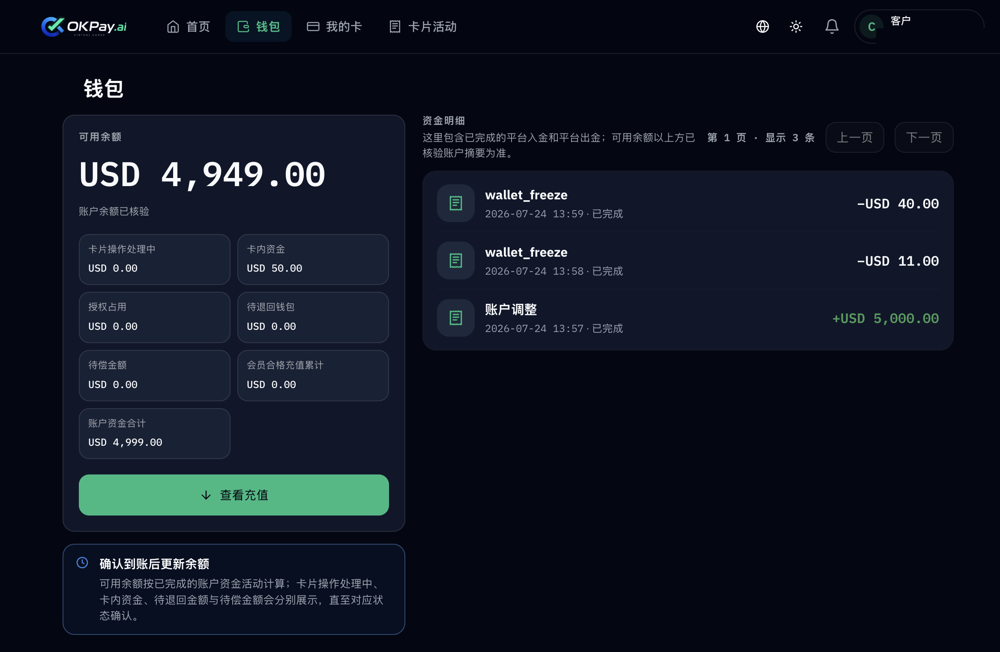
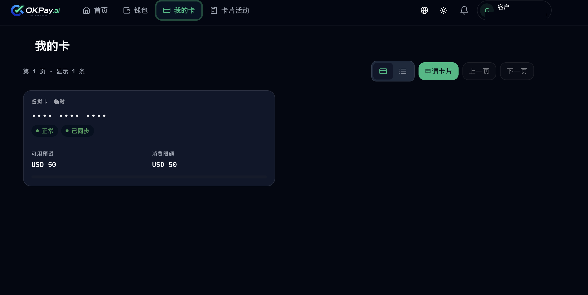
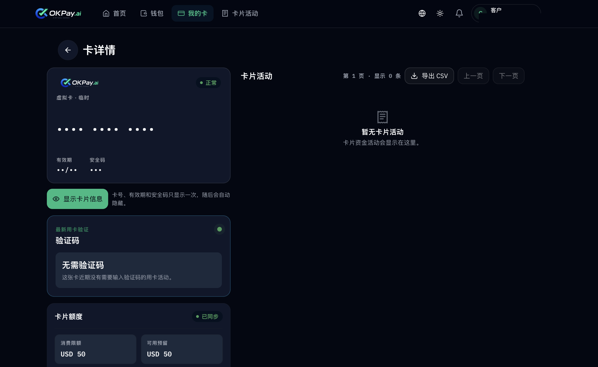

# OKPay.ai 用户手册

OKPay.ai 是一个虚拟卡平台。用户可以通过 USDT / USDC 充值账户余额，一键签发虚拟卡，用于线上消费、订阅付款等场景。

**使用流程：** 注册账户 → 充值余额（USDT / USDC）→ 签发虚拟卡 → 线上消费与查账。

👉 **[立即使用 OKPay.ai](https://okpay.ai)** ｜ [快速开始](docs/01-快速开始.md) ｜ [查看费率](docs/08-费率与会员等级.md) ｜ [常见问题](docs/10-常见问题FAQ.md)

## 产品预览

以下截图均已脱敏处理，仅用于展示产品界面。

**钱包 · 余额与资金明细**

**我的卡 · 虚拟卡列表**

**卡详情 · 卡片信息与额度**

## 文档目录

| 章节 | 说明 |
| --- | --- |
| [00 · 简介](docs/00-简介.md) | OKPay.ai 是什么、能做什么 |
| [01 · 快速开始](docs/01-快速开始.md) | 注册 → 充值 → 发卡 → 使用，四步上手 |
| [02 · 账户注册与登录](docs/02-账户注册与登录.md) | 邮箱注册、登录、找回密码 |
| [03 · 充值到账](docs/03-充值到账.md) | 钱包充值与到账核验 |
| [04 · 钱包与资金明细](docs/04-钱包与资金明细.md) | 可用余额、余额构成、资金流水 |
| [05 · 申请与签发虚拟卡](docs/05-申请与签发虚拟卡.md) | 消费限额、卡片期限、发卡费用 |
| [06 · 管理我的卡](docs/06-管理我的卡.md) | 查看卡片信息、退款、卡片操作 |
| [07 · 卡片活动与流水](docs/07-卡片活动与流水.md) | 卡片活动记录、导出 CSV |
| [08 · 费率与会员等级](docs/08-费率与会员等级.md) | 开卡费、充值/退款费率、会员等级权益 |
| [09 · 安全与隐私](docs/09-安全与隐私.md) | 信息打码、账户与数据安全 |
| [10 · 常见问题 FAQ](docs/10-常见问题FAQ.md) | 高频问题解答 |
| [11 · 联系我们](docs/11-联系我们.md) | 客服与支持渠道 |

## 如何贡献

1. Fork 本仓库并新建分支。
2. 修改或新增 `docs/` 下的 Markdown 文件。
3. 提交 Pull Request，简要说明改动内容。

## 许可

除非另有说明，本手册内容采用 [CC BY 4.0](https://creativecommons.org/licenses/by/4.0/deed.zh) 许可。

## 官方入口

- 官网：https://okpay.ai
- 应用入口：https://okpay.ai/app/home
